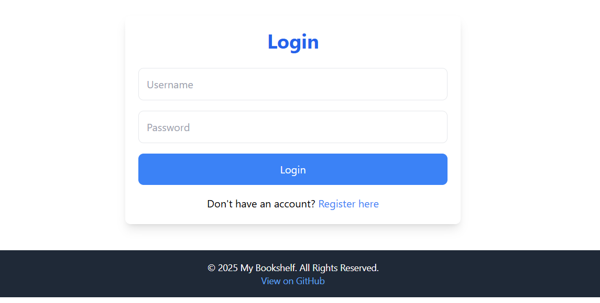
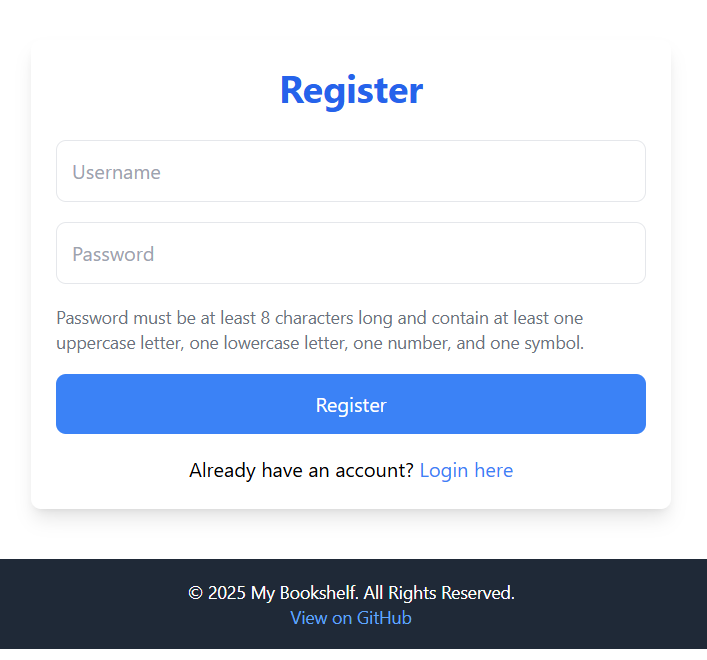
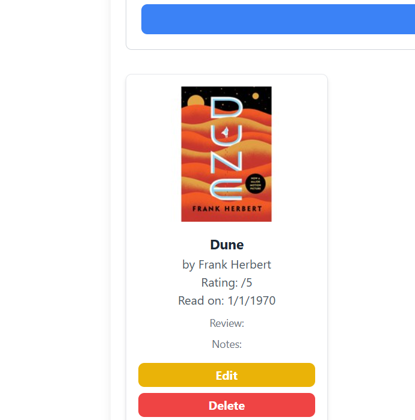
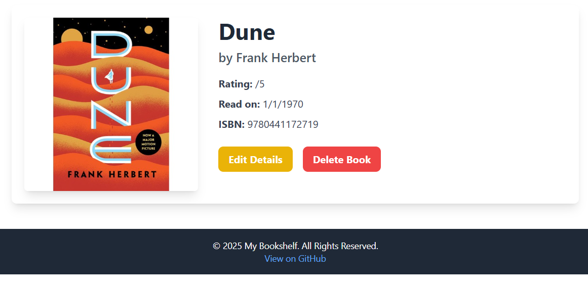

# 📚 My Bookshelf Capstone Project

A full-stack web application for tracking books you've read, taking notes, and managing personal book reviews.  
This project was built as a **capstone** to demonstrate proficiency in **Node.js, Express, PostgreSQL, and API integration**.

---

## ✨ Features

- **User Authentication**: Secure user registration, login, and logout.  
- **CRUD Operations**: Add, view, edit, and delete book entries.  
- **Dynamic Sorting**: Sort your books by rating and recency.  
- **API Integration**: Fetch book titles, authors, and cover images from the **Open Library API** using a simple ISBN search.  
- **Personalized Library**: Each user's book entries are private and tied to their account.  
- **Responsive UI**: A modern and clean interface built with **Tailwind CSS**.  

---

## 💻 Technologies Used

- **Backend**: Node.js, Express.js  
- **Database**: PostgreSQL  
- **Authentication**: bcrypt (password hashing), express-session (session management)  
- **Templating**: EJS  
- **Styling**: Tailwind CSS  
- **API Integration**: Axios  

---

## 🚀 Setup and Installation

### 2. Install dependencies
```bash```
npm install


### Prerequisites
- [Node.js](https://nodejs.org/)  
- [PostgreSQL](https://www.postgresql.org/)  

---

### 1. Clone the repository

```bash
git clone https://github.com/your-username/your-repo-name.git
cd your-repo-name```

### 3. Database setup

**Create a PostgreSQL database and run the following SQL commands to create tables:**
```sql
CREATE TABLE users (
    id SERIAL PRIMARY KEY,
    username VARCHAR(50) UNIQUE NOT NULL,
    password VARCHAR(100) NOT NULL
);```
```bash
CREATE TABLE books (
    id SERIAL PRIMARY KEY,
    title TEXT NOT NULL,
    authors TEXT,
    isbn TEXT,
    cover_id TEXT,
    rating INT CHECK (rating >= 1 AND rating <= 5),
    review TEXT,
    notes TEXT,
    read_date DATE,
    created_at TIMESTAMP DEFAULT now(),
    updated_at TIMESTAMP DEFAULT now(),
    user_id INTEGER REFERENCES users(id) ON DELETE CASCADE
);```

### 4. Configure environment variables

**Create a .env file in the root of your project and add:**
```env
PG_USER=your_postgres_username
PG_HOST=localhost
PG_DATABASE=your_db_name
PG_PASSWORD=your_db_password
PG_PORT=5432
PORT=3000
OPEN_LIBRARY_API_URL=https://openlibrary.org/api/books.```

### 5. Run the application

*You need two terminals:*

**Terminal 1 – build Tailwind CSS:**
```bash
npm run build:css```


**Terminal 2 – start the server:**
```bash
nodemon index.js```

## 📸 Screenshots

### 🔐 Authentication
  


### 📖 Library


### 📖 added Books


### 📖 Books



